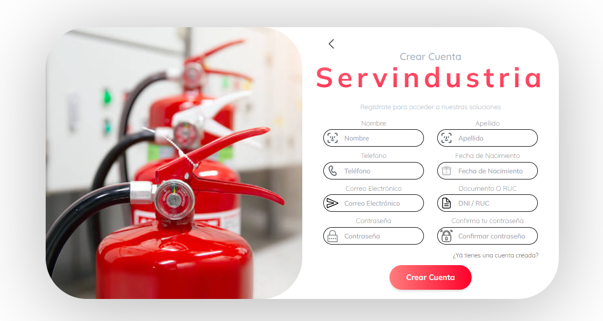
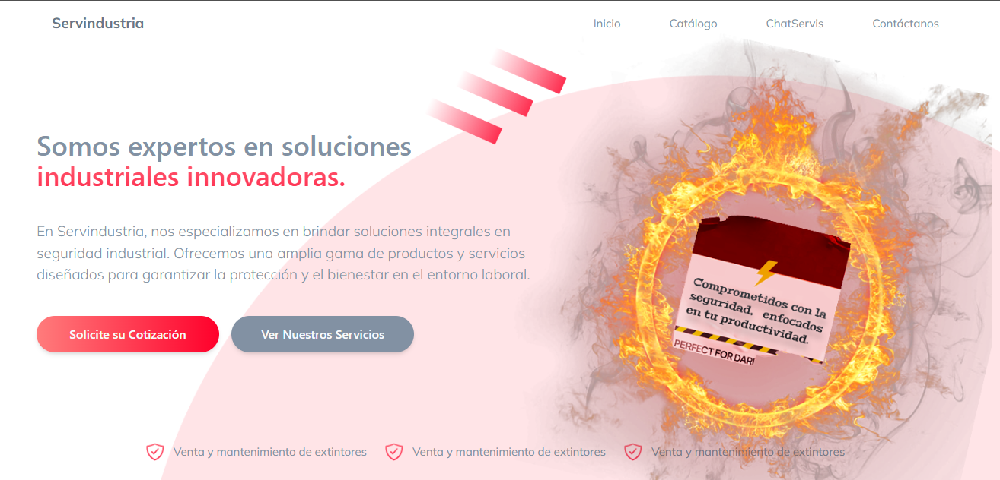
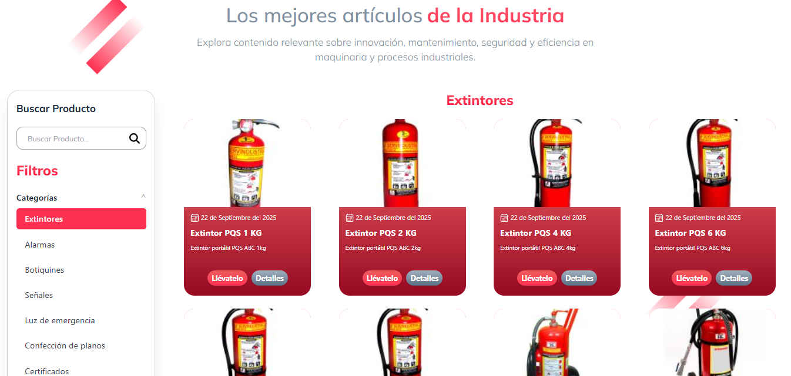
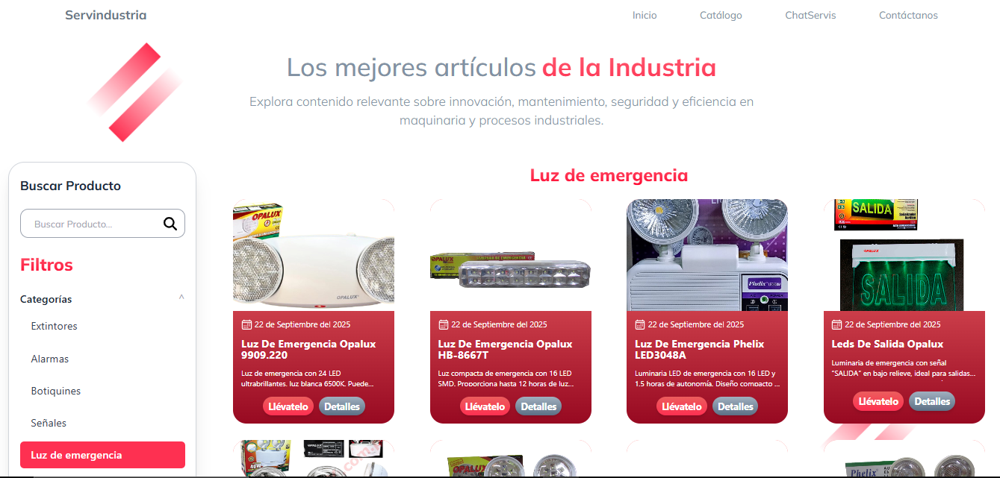
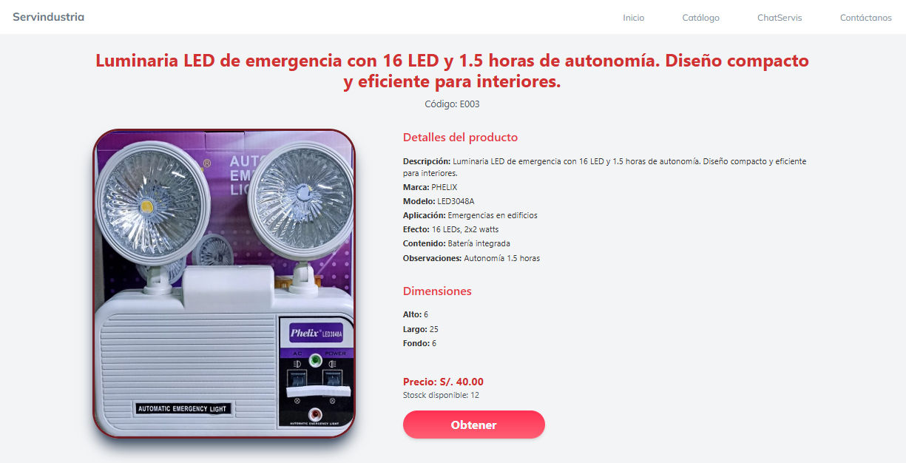
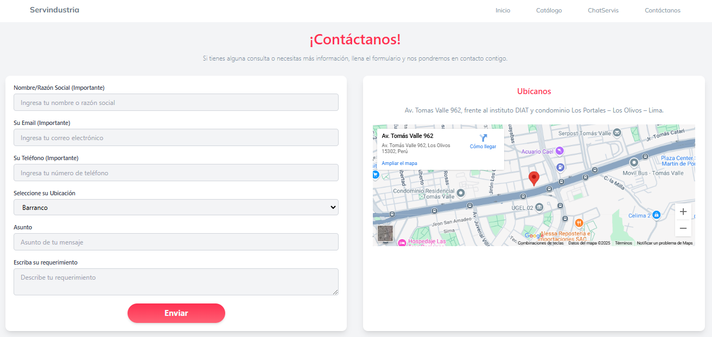
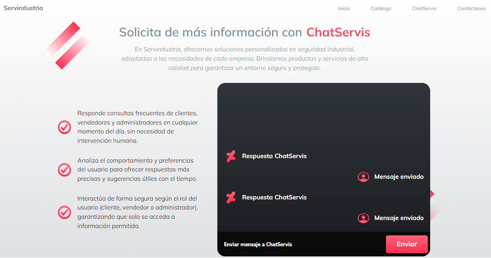
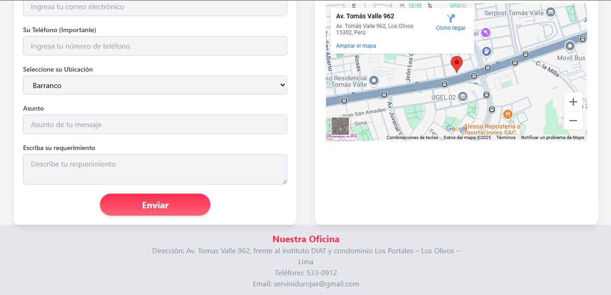
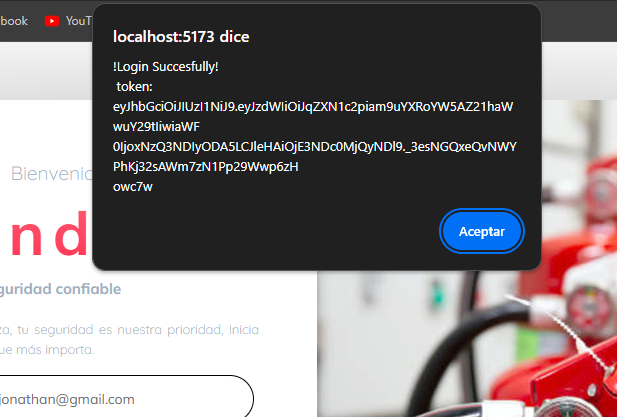

# Servindustria Web Application

## Descripción

Servindustria es una aplicación web diseñada para la gestión de inventarios y productos, con funcionalidades para categorías, cotizaciones y autenticación de usuarios. El proyecto está dividido en dos partes principales:

- **Client**: Un frontend construido con React, estilizado con Tailwind CSS y gestionado con Vite. Incluye componentes dinámicos y animaciones con Framer Motion, además de enrutamiento con React Router.
- **Server**: Un backend desarrollado en Java con Spring Boot, que proporciona una API RESTful para manejar autenticación (JWT), usuarios, productos, inventarios, categorías y cotizaciones.

El propósito principal de esta aplicación es facilitar la gestión de inventarios y productos para una empresa, con una interfaz de usuario moderna y responsiva.

## Estructura del Proyecto
.
├── Client
│   ├── node_modules/           # Dependencias del frontend
│   ├── public/                 # Recursos públicos (imágenes de productos, etc.)
│   ├── src/                    # Código fuente del frontend
│   │   ├── assets/             # Imágenes, iconos, fuentes (Mulish y Quicksand)
│   │   ├── components/         # Componentes reutilizables (como Navbar)
│   │   ├── layouts/            # Diseños de página
│   │   ├── pages/              # Páginas dinámicas
│   │   └── styles/             # Estilos personalizados
├── Server
│   └── WebPage
│       ├── src/                # Código fuente del backend
│       │   ├── main/           # Código principal
│       │   │   ├── java/       # Código Java (paquete com.Servindustria.WebPage)
│       │   │   │   └── com/Servindustria/WebPage/
│       │   │   │       ├── Auth/       # Autenticación (JWT)
│       │   │   │       ├── Classes/    # Módulos de negocio (Category, Inventory, Product, Quote)
│       │   │   │       ├── Config/     # Configuraciones del servidor
│       │   │   │       ├── Exception/  # Manejo de excepciones
│       │   │   │       └── User/       # Gestión de usuarios
│       │   │   └── resources/  # Recursos estáticos y plantillas
│       │   └── test/           # Pruebas unitarias
│       └── target/             # Archivos generados por Maven
└── screenshots/                # Capturas de pantalla del proyecto

## Tecnologías Utilizadas

### Frontend (Client)
- **React**: Biblioteca para construir interfaces de usuario.
- **Tailwind CSS**: Framework de estilos para un diseño moderno y responsivo.
- **Framer Motion**: Animaciones y transiciones.
- **React Router**: Enrutamiento dinámico.
- **Vite**: Herramienta de construcción rápida.
- **EmailJS**: Para enviar correos electrónicos (por ejemplo, desde formularios).

### Backend (Server)
- **Java (Spring Boot)**: Framework para construir la API RESTful.
- **JWT**: Autenticación basada en tokens.
- **Maven**: Gestión de dependencias y construcción del proyecto.
- **SQL Server**: Base de datos relacional para almacenar datos.

## Requisitos Previos

Antes de comenzar, asegúrate de tener instalado lo siguiente:

- **Node.js** (versión 18.x o superior) para el frontend.
- **npm** o **yarn** para gestionar las dependencias del frontend.
- **Java** (versión 17 o superior) para el backend.
- **Maven** para construir y ejecutar el backend.
- **SQL Server**: Base de datos relacional (asegúrate de que el servidor esté corriendo en `localhost:1433`).

## Instalación

### 1. Clonar el Repositorio
```bash
git clone <URL_DEL_REPOSITORIO>
cd <NOMBRE_DEL_REPOSITORIO>
```

### 2. Configurar el Frontend (Client)
Navega al directorio del cliente:
```bash
cd Client
```
Instala las dependencias:
```bash
npm install
```
(Opcional) Configura variables de entorno, como las credenciales de EmailJS, en un archivo `.env`:
```env
VITE_EMAILJS_SERVICE_ID=tu_service_id
VITE_EMAILJS_TEMPLATE_ID=tu_template_id
VITE_EMAILJS_PUBLIC_KEY=tu_public_key
```

### 3. Configurar el Backend (Server)
Navega al directorio del servidor:
```bash
cd Server/WebPage
```
Configura las variables de entorno necesarias para la conexión a SQL Server y JWT en `src/main/resources/application.properties`:
```properties
spring.application.name=WebPage
# Configuración de JPA/Hibernate
spring.jpa.hibernate.ddl-auto=update
spring.jpa.show-sql=true
spring.jpa.database-platform=org.hibernate.dialect.SQLServerDialect
# Clase del driver JDBC de Microsoft
spring.datasource.driver-class-name=com.microsoft.sqlserver.jdbc.SQLServerDriver
spring.datasource.url=jdbc:sqlserver://localhost:1433;databaseName=NegocioIntegrador;encrypt=true;trustServerCertificate=true
spring.datasource.username=JonaPoo
spring.datasource.password=3101
# Configuración de JWT (reemplaza con tu secreto)
jwt.secret=tu_secreto_jwt
```

Construye el proyecto con Maven:
```bash
mvn clean install
```

## Ejecución

### 1. Iniciar el Backend
Desde el directorio `Server/WebPage`, ejecuta:
```bash
mvn spring-boot:run
```
El servidor estará disponible en [http://localhost:8080](http://localhost:8080).

### 2. Iniciar el Frontend
Desde el directorio `Client`, ejecuta:
```bash
npm run dev
```
El frontend estará disponible en [http://localhost:5173](http://localhost:5173) (o el puerto que Vite asigne).

## Uso

Accede a la aplicación desde el navegador en [http://localhost:5173](http://localhost:5173).  
Usa las credenciales de prueba (si las hay) para iniciar sesión o regístrate como nuevo usuario.  
Explora las funcionalidades de gestión de productos, inventarios y cotizaciones.

## Contribución

1. Haz un fork del repositorio.
2. Crea una nueva rama para tu funcionalidad:
```bash
git checkout -b feature/nueva-funcionalidad
```
3. Realiza tus cambios y haz commit:
```bash
git commit -m "Agrega nueva funcionalidad"
```
4. Envía un pull request.

## Guía de Usuario

Esta sección ofrece una visión general de las funcionalidades de la aplicación para usuarios finales. Para detalles completos, consulta el archivo [USER_GUIDE.md](docs/USER_GUIDE.md).

### 1. Login
- **Iniciar Sesión**: Ingresa tu usuario y contraseña en la página de login.
  
- **¿Olvidaste tu Contraseña?**: Usa el enlace para restablecerla.
- **Registro**: Regístrate como nuevo usuario si no tienes cuenta.
  

### 2. Inicio
- Accede a **Mis Extintores**, **Solicitar Servicio Técnico**, **Agenda de Mantenimientos**, **Reportes y Certificados**, y **Atención al Cliente**.
  

### 3. Servicios
- **Mantenimiento Preventivo**, **Recarga de Extintores**, **Inspección Técnica**, **Certificados y Reportes**, y **Recolección y Entrega**.
  

### 4. Tienda
- Compra extintores (e.g., Polvo Seco, CO₂) y accesorios (e.g., señales, soportes). Opciones de pago: transferencia, tarjeta, o contra entrega.
  
  
  

### 5. Gestión (Usuarios, Personal, Capacitaciones, Almacén, Ventas)
- Registra y gestiona usuarios, personal, capacitaciones, inventario de extintores y ventas mediante formularios y tablas.

### 6. Contacto y Soporte
- Usa el formulario de contacto o el chatbot para asistencia.
  
  
  

### Contacto
- **Teléfono**: 533-0912 / 922 145 930
- **Correo**: servindu.rojas@gmail.com
- **Horarios**: Lunes - Viernes: 8:00 AM - 5:30 PM, Sábado: 8:00 AM - 1:00 PM, Domingo: Cerrado
- **Redes Sociales**: Facebook, WhatsApp, Email

## Licencia

Este proyecto está bajo la licencia [MIT License](LICENSE).

## Contacto

Para cualquier consulta, puedes contactar al equipo de desarrollo en [servindu.team@gmail.com](mailto:jesusjbjonathan@gmail.com).

© 2025 Servindustria Ltda. Todos los derechos reservados.

---

# Guía de Usuario - Servindustria Extintores y Fumigaciones E.I.R.L.

Esta guía está diseñada para usuarios finales que deseen navegar y utilizar las funcionalidades de la aplicación web de Servindustria.

## 1. Login
# 🔐 Login - Sistema Interno | Empresa de Servindustria
> Bienvenido a Servindustria Extintores y Fumigaciones E.I.R.L.
> Por favor, inicia sesión con tus credenciales para continuar.


### 👤 Iniciar Sesión
- **Usuario**: Ingresa tu nombre de usuario.
- **Contraseña**: Ingresa tu contraseña.
- **Acción**: Haz clic en "Iniciar Sesión".

### ❓ ¿Olvidaste tu Contraseña?
- Haz clic en el enlace "Restablecer Contraseña" para recuperarla.

### 🆕 ¿No Tienes una Cuenta?
- Regístrate como nuevo usuario en la página de registro.




## 2. Inicio
# 🌐 Portal de Servindustria Extintores y Fumigaciones E.I.R.L.
- **Navegación**: [Inicio](#) | [Capacitaciones](#) | [Tienda](#) | [Perfil](#)


### 📋 Menú Principal
- 🧯 **Mis Extintores**: Consulta la lista de tus extintores, fechas de vencimiento y ubicación.
- 🛠️ **Solicitar Servicio Técnico**: Pide mantenimiento o recarga de extintores.
- 🗓️ **Agenda de Mantenimientos**: Revisa las fechas programadas para mantenimientos.
- 📄 **Reportes y Certificados**: Descarga tus informes de inspección y certificados.
- 💬 **Atención al Cliente**: Contáctanos vía formulario o chat.

## 3. Servicios
# 🛠️ Servicios de Servindustria Extintores y Fumigaciones E.I.R.L.
- **Navegación**: [Inicio](#) | [Capacitaciones](#) | [Tienda](#) | [Perfil](#)


### ✅ Servicios Disponibles
#### 🔧 Mantenimiento Preventivo
- Realiza la inspección rutinaria de tus extintores para asegurar su buen estado.
- **[Solicitar Mantenimiento]**

#### ♻️ Recarga de Extintores
- Solicita la recarga de tus extintores descargados o vencidos.
- **[Solicitar Recarga]**

#### 🧯 Inspección Técnica
- Programa una visita técnica para verificar el estado de tus equipos.
- **[Agendar Inspección]**

#### 🧯 Certificados y Reportes
- Descarga certificados de inspección, mantenimiento o cumplimiento normativo.
- **[Ver Certificados]**

#### 🚚 Recolección y Entrega
- Solicita la recolección de extintores para mantenimiento y entrega.
- **[Programar Servicio de Transporte]**

### 📌 Estado de Mis Servicios
| Servicio                | Fecha Solicitada | Estado     | Técnico Asignado |
|-------------------------|------------------|------------|------------------|
| Mantenimiento Preventivo| 2025-05-08       | En proceso | Pedro Pérez      |
| Recarga de Extintor     | 2025-04-28       | Finalizado | Linda Torres     |
| Inspección Técnica      | 2025-05-15       | Programado | Omar Quispe      |

## 4. Tienda
# 🛒 Tienda de Servindustria Extintores y Fumigaciones E.I.R.L.
- **Navegación**: [Inicio](#) | [Capacitaciones](#) | [Tienda](#) | [Perfil](#)


### 🧯 Extintores Disponibles
| Producto            | Tipo               | Precio     | Stock | Acción               |
|---------------------|--------------------|------------|-------|----------------------|
| Extintor PQS 6kg    | Polvo Seco        | $45.00 USD | 20    | **[Agregar al carrito]** |
| Extintor CO₂ 5lb    | Dióxido de Carbono| $60.00 USD | 15    | **[Agregar al carrito]** |
| Extintor ABC 9kg    | Multipropósito    | $75.00 USD | 10    | **[Agregar al carrito]** |

### 🚧 Señales y Accesorios
| Producto                     | Descripción                   | Precio     | Acción               |
|------------------------------|-------------------------------|------------|----------------------|
| Señal "Salida de Emergencia" | PVC reflectante 20x30cm      | $8.00 USD  | **[Agregar al carrito]** |
| Soporte metálico de pared    | Compatible con extintores 6-10kg | $12.00 USD | **[Agregar al carrito]** |
| Gabinete para extintor       | Metálico con visor frontal   | $35.00 USD | **[Agregar al carrito]** |

### 🧯 Mi Carrito
> _No hay productos en el carrito actualmente._

### 📦 Envíos y Entregas
- Entrega a domicilio disponible en todo el país.
- Tiempo estimado de entrega: 3 a 5 días hábiles.
- Retiro en tienda física disponible (previa coordinación).

### 💳 Métodos de Pago
- Transferencia bancaria
- Tarjeta de crédito o débito
- Pago contra entrega (solo algunas zonas)

## 5. Usuarios
# 👥 Usuarios - Servindustria Extintores y Fumigaciones E.I.R.L.
- **Navegación**: [Dashboard](#) | [Usuarios](#) | [Personal](#) | [Capacitaciones](#)
- **Almacén**: [Extintores](#) | [Repuestos](#) | [Accesorios](#) | [Ventas](#) | [Cerrar Sesión](#)

### 👥 Gestión de Usuarios
#### Formulario de Registro de Usuarios
- **DNI**: Ingresa tu DNI
- **Nombre**: Ingresa tu Nombre
- **Apellido**: Ingresa tu Apellido
- **Contraseña**: Ingresa tu Contraseña
- **Correo**: Ingresa tu Correo
- **Teléfono**: Ingresa tu Teléfono
- **Dirección**: Ingresa tu Dirección

#### Botones de Acción
- **[Buscar]** 🔍
- **[Ingresar]** ✈️
- **[Modificar]** ✏️
- **[Eliminar]** 🗑️

#### Tabla de Usuarios
| DNI       | Nombre | Apellido | Contraseña | Correo            | Teléfono     | Dirección       |
|-----------|--------|----------|------------|-------------------|--------------|-----------------|
| (Ejemplo) | Juan   | Pérez    | ****       | juan@example.com  | 922 145 930  | Av. Siempre Viva|

## 6. Personal
# 🧯🔧 Personal - Servindustria Extintores y Fumigaciones E.I.R.L.
- **Navegación**: [Dashboard](#) | [Usuarios](#) | [Personal](#) | [Capacitaciones](#)
- **Almacén**: [Extintores](#) | [Repuestos](#) | [Accesorios](#) | [Ventas](#) | [Cerrar Sesión](#)

### 🧯🔧 Gestión del Personal
#### Formulario de Registro de Personal
- **DNI**: Ingresa tu DNI
- **Nombre**: Ingresa tu Nombre
- **Apellido**: Ingresa tu Apellido
- **Cargo**: Ingresa tu Cargo
- **Sueldo**: Ingresa tu Sueldo
- **Horas**: Ingresa tus Horas

#### Botones de Acción
- **[Buscar]** 🔍
- **[Ingresar]** ✈️
- **[Modificar]** ✏️
- **[Eliminar]** 🗑️

#### Tabla de Personal
| DNI       | Nombre | Apellido | Cargo          | Sueldo   | Horas |
|-----------|--------|----------|----------------|----------|-------|
| (Ejemplo) | Pedro  | Pérez    | Técnico        | $800 USD | 40    |

## 7. Capacitaciones
# 🚒 Capacitaciones - Servindustria Extintores y Fumigaciones E.I.R.L.
- **Navegación**: [Dashboard](#) | [Usuarios](#) | [Personal](#) | [Capacitaciones](#)
- **Almacén**: [Extintores](#) | [Repuestos](#) | [Accesorios](#) | [Ventas](#) | [Cerrar Sesión](#)

### 🚒 Plataforma de Capacitaciones
#### Formulario de Registro de Capacitaciones
- **DNI**: Ingresa tu DNI
- **Nombre**: Ingresa tu Nombre
- **Apellido**: Ingresa tu Apellido
- **Día**: Ingresa el día
- **Hora**: Ingresa la hora
- **Número de Contacto**: Ingresa tu número de contacto
- **Tipo de Capacitación**: Selecciona el tipo
- **Encargado**: Ingresa el encargado

#### Botones de Acción
- **[Buscar]** 🔍
- **[Ingresar]** ✈️
- **[Modificar]** ✏️
- **[Eliminar]** 🗑️

#### Tabla de Capacitaciones
| DNI       | Nombre | Apellido | Día        | Hora  | Tipo de Capacitación   | Contacto    |
|-----------|--------|----------|------------|-------|------------------------|-------------|
| (Ejemplo) | Ana    | Gómez    | 2025-06-01 | 10:00 | Uso de Extintores      | 922 145 930 |

## 8. Almacén
# 🏭 Almacén - Servindustria Extintores y Fumigaciones E.I.R.L.
- **Navegación**: [Dashboard](#) | [Usuarios](#) | [Personal](#) | [Capacitaciones](#)
- **Almacén**: [Extintores](#) | [Repuestos](#) | [Accesorios](#) | [Ventas](#) | [Cerrar Sesión](#)

### 🏭 Almacén General - Extintores
#### Formulario de Registro de Extintores
- **ID Extintor**: Ingresa el ID del extintor
- **Nombre de Producto**: Ingresa el nombre del producto
- **Tipo**: Ingresa el tipo
- **Cantidad**: Ingresa la cantidad
- **Precio**: Ingresa el precio
- **Stock**: Ingresa el stock
- **Fecha de Vencimiento**: Ingresa la fecha de vencimiento

#### Botones de Acción
- **[Buscar]** 🔍
- **[Ingresar]** ✈️
- **[Modificar]** ✏️
- **[Eliminar]** 🗑️

#### Tabla de Extintores
| ID  | Nombre         | Tipo         | Cantidad | Precio    | Stock | Fecha de Vencimiento |
|-----|----------------|--------------|----------|-----------|-------|----------------------|
| E01 | Extintor PQS   | Polvo Seco   | 5        | $45.00 USD| 20    | 2026-05-01           |

## 9. Ventas
# 💼 Área de Ventas - Servindustria Extintores y Fumigaciones E.I.R.L.
- **Navegación**: [Dashboard](#) | [Usuarios](#) | [Personal](#) | [Capacitaciones](#)
- **Almacén**: [Extintores](#) | [Repuestos](#) | [Accesorios](#) | [Ventas](#) | [Cerrar Sesión](#)

### 💼 Plataforma de Ventas
#### Formulario de Registro de Ventas
- **Nº de Venta**: Ingresa el número de venta
- **ID Extintor**: Ingresa el ID del extintor
- **Nombre de Extintor**: Ingresa el nombre del producto
- **Nombre de Cliente**: Ingresa el nombre del cliente
- **Dirección**: Ingresa la dirección
- **Número de Contacto**: Ingresa el número de contacto
- **Cantidad**: Ingresa la cantidad
- **Día**: Ingresa el día
- **Hora**: Ingresa la hora

#### Botones de Acción
- **[Buscar]** 🔍
- **[Ingresar]** ✈️
- **[Modificar]** ✏️
- **[Eliminar]** 🗑️

#### Tabla de Ventas
| Nº Venta | ID Extintor | Nombre de Extintor | Nombre del Cliente | Cantidad | Día        | Hora  |
|----------|-------------|--------------------|--------------------|----------|------------|-------|
| V001     | E01         | Extintor PQS       | Juan Pérez         | 2        | 2025-05-16 | 14:00 |

## 10. Información de Contacto
- 📱 **Teléfono**: 533-0912 / 922 145 930
- 📧 **Correo**: servindu.rojas@gmail.com
- 🕒 **Horarios**: Lunes - Viernes: 8:00 AM - 5:30 PM, Sábado: 8:00 AM - 1:00 PM, Domingo: Cerrado
- 🌐 **Sitio web**: [www.servindustria.com](https://www.servindustria.com)

### Redes Sociales
- Facebook
- WhatsApp
- Email


## 11. Sobre Servindustria
**Servindustria** es una empresa dedicada a la **venta, mantenimiento y recarga de extintores**, comprometida con la seguridad contra incendios y el cumplimiento de normativas peruanas e internacionales.

© 2025 Servindustria Ltda. Todos los derechos reservados.
